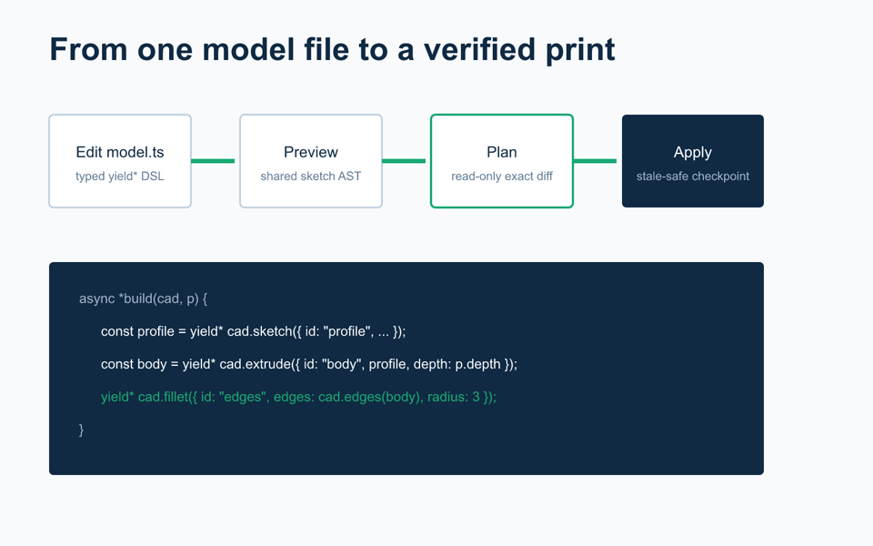

# Onshape CadScript



Write one typed TypeScript model, let Codex iterate on it with you, and deploy it into a dedicated Onshape Part Studio through your existing signed-in Chrome session.

<!-- coverage:start -->
[](./COVERAGE.md) [](./COVERAGE.md) [](./ROADMAP.md)
<!-- coverage:end -->

> **Unofficial community project.** Onshape CadScript is not affiliated with, endorsed by, or supported by Onshape or PTC.

```ts
export default defineModel({
  name: "my-print",
  units: "mm",
  parameters: { depth: lengthParam(8) },
  async *build(cad, p) {
    const profile = yield* cad.sketch({
      id: "profile",
      plane: cad.top,
      entities: [sketch.roundedRectangle("outline", [-20, -12], [20, 12], length(3))],
    });
    yield* cad.extrude({ id: "body", profile, depth: p.depth });
  },
});
```

## Start With Codex

Paste this into Codex:

> Install and configure Onshape CadScript from github.com/ricokahler/onshape-cadscript, connect it to my Onshape browser session, and create a new printable CAD project.

Or install the plugin directly:

```sh
codex plugin marketplace add ricokahler/onshape-cadscript --sparse .agents/plugins
codex plugin add onshape-cadscript@onshape-cadscript
```

The convenience installer runs those same supported Codex commands and verifies the result:

```sh
npx -y onshape-cadscript@0.1.0 setup codex
```

Then start a new Codex task and ask for a CAD model. The bundled skill guides Codex through inspect, edit, preview, plan, exact apply, render, measure, no-op verification, and STL export.

## Browser Setup

CadScript does not receive your Onshape password or an API key. A narrow Chrome extension performs allowlisted Onshape API requests using the browser session you already control, while a token-protected native host carries messages locally.

1. Install the Chrome Web Store extension. Until review is complete, use the [unpacked development instructions](https://ricokahler.github.io/onshape-cadscript/setup/chrome.html).
2. Open Onshape in Chrome and sign in normally.
3. Run `cadscript bridge install --extension-id <extension-id>`.
4. Run `cadscript doctor --json`.

The v0.1 bridge supports macOS 13+ with Google Chrome and Node.js 22.14+. Other desktop/browser combinations are tracked in the [roadmap](./ROADMAP.md).

## Why This Shape

- **One model file.** The async generator and `yield*` DSL reads like a build log and returns symbolic references for later features.
- **One sketch AST.** Onshape compilation, SVG/PNG preview, and SVG import share the same geometry model.
- **Read-only plans.** Apply requires the exact content-addressed plan ID and refuses stale Onshape microversions.
- **Small blast radius.** One model owns one dedicated Part Studio; structural edits replace only the changed suffix.
- **Verification is part of apply.** Errors and warnings fail, then CadScript rereads, renders, measures, and requires a no-op next plan.

## Examples

- [Tolerance coupon](./examples/tolerance-coupon): tune sliding and pocket fit before a full print.
- [Revolved knob](./examples/revolved-knob): profile sketch, symbolic axis query, revolve, and fillet.
- [SVG keychain](./examples/svg-keychain): import vector art into the shared sketch AST.

Read the [documentation](https://ricokahler.github.io/onshape-cadscript/), [coverage catalog](./COVERAGE.md), [roadmap](./ROADMAP.md), [security policy](./SECURITY.md), and [contributing guide](./CONTRIBUTING.md).

MIT licensed.
