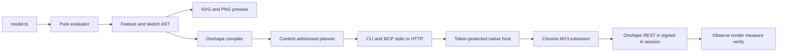

# Architecture

The evaluator has no transport dependency. It resolves validated parameters and consumes an async generator into immutable features with stable symbolic IDs.

The planner compares desired feature IDs and hashes with local ownership state plus current remote observation. Content changes update in place; structural changes preserve a common prefix and replace the suffix.

The bridge is deliberately narrow. The local TCP endpoint binds to `127.0.0.1`, checks a random token, negotiates protocol version 1, bounds payloads, times out requests, and forwards only allowlisted Onshape paths. The extension handles REST requests and one fixed selection adapter. There is no generic page evaluator.

One model owns one dedicated Part Studio. Onshape-generated feature IDs stay in local state; model code uses only symbolic IDs.

The optional PM2 daemon owns only a loopback Streamable HTTP MCP process. It does not replace or supervise native messaging: Chrome still launches the native host on demand and owns that process's stdin/stdout channel.
